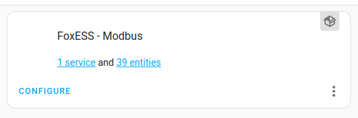
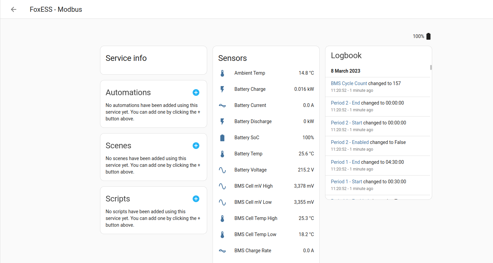
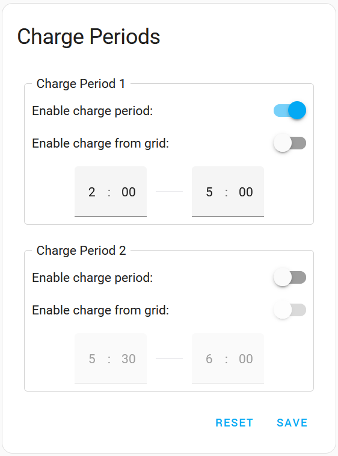
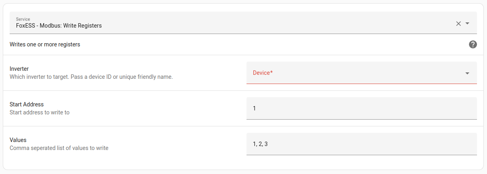
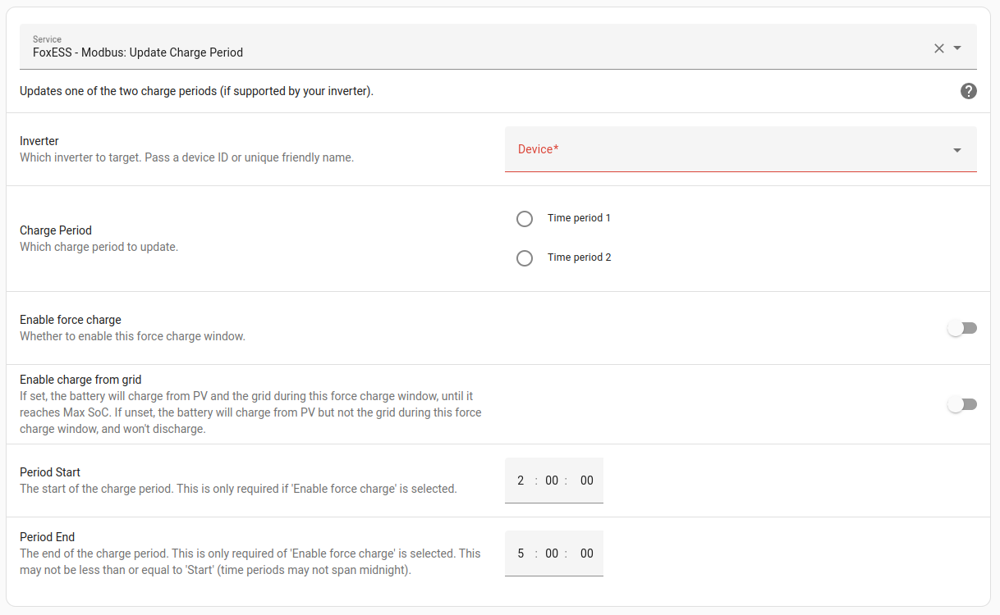
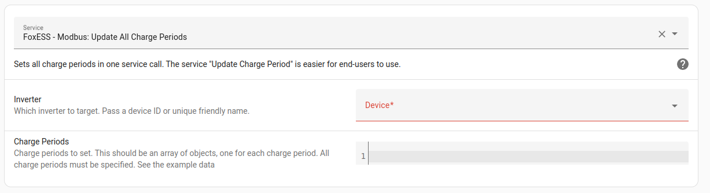

# FoxESS - Modbus

[![GitHub Release][releases-shield]][releases]
[![GitHub Activity][commits-shield]][commits]
[![License][license-shield]](LICENSE)

[![pre-commit][pre-commit-shield]][pre-commit]
[![Black][black-shield]][black]

[![hacs][hacsbadge]][hacs]
[![Project Maintenance][maintenance-shield]][user_profile]
[![BuyMeCoffee][buymecoffeebadge]][buymecoffee]

[![Discord][discord-shield]][discord]
[![Community Forum][forum-shield]][forum]

\*\* **This project is not endorsed by, directly affiliated with, maintained, authorized, or sponsored by FoxESS** \*\*

## Introduction

A Home Assistant custom component designed to ease integrating modbus data from Fox H1 inverters.

Features include:

- Read registers in bulk to improve Home Assistant performance
- Direct decoding of values (i.e. force charge periods)
- Set charge periods, work mode, min/max SoC (when connected over RS485 only)

Supported models:

- H1 (including AC1 and AIO)
- H3 (including AOI)
- KH

**[See the wiki](https://github.com/nathanmarlor/foxess_modbus/wiki) for how-to articles and FAQs**

## Installation

[][my-hacs]

Migrating from StealthChesnut's HA-FoxESS-Modbus? [Read this](https://github.com/nathanmarlor/foxess_modbus/wiki/Migrating-from-HA-FoxESS-Modbus).

Recommended installation through [HACS][hacs]:

1. Either [use this link][my-hacs], or navigate to HACS integration and:
   - 'Explore & Download Repositories'
   - Search for 'FoxESS - Modbus'
   - Download
2. Restart Home Assistant
3. Go to Settings > Devices and Services > Add Integration
4. Search for and select 'FoxESS - Modbus' (If the integration is not found, empty your browser cache and reload the page)
5. Proceed with the configuration

## Usage

1. Navigate to Settings -> Devices & Services to find:

2. Select '1 device' to find all Modbus readings:

## Charge Periods

If your inverter supports setting charge periods, you can use install the [Charge Periods lovelace card](https://github.com/nathanmarlor/foxess_modbus_charge_period_card):

## Services

### Write Service

A service to write any modbus address is available, similar to the native Home Assistant service. To use a service, navigate to Developer Tools -> Services and select it from the drop-down.

### Update Charge Periods

Updates one of the two charge periods (if supported by your inverter).

### Update All Charge Periods

Sets all charge periods in one service call. The service "Update Charge Period" is easier for end-users to use.

---

[black]: https://github.com/psf/black
[black-shield]: https://img.shields.io/badge/code%20style-black-000000.svg?style=for-the-badge
[buymecoffee]: https://www.buymeacoffee.com/nathanmarlor
[buymecoffeebadge]: https://img.shields.io/badge/buy%20me%20a%20coffee-donate-yellow.svg?style=for-the-badge
[commits-shield]: https://img.shields.io/github/commit-activity/y/nathanmarlor/foxess_modbus.svg?style=for-the-badge
[commits]: https://github.com/nathanmarlor/foxess_modbus/commits/main
[hacs]: https://hacs.xyz
[hacsbadge]: https://img.shields.io/badge/HACS-Custom-orange.svg?style=for-the-badge
[my-hacs]: https://my.home-assistant.io/redirect/hacs_repository/?owner=nathanmarlor&repository=foxess_modbus&category=integration
[discord]: https://discord.gg/Qa5fW2R
[discord-shield]: https://img.shields.io/discord/330944238910963714.svg?style=for-the-badge
[foxessimg]: https://github.com/home-assistant/brands/raw/master/custom_integrations/foxess/logo.png
[foxess_modbus]: https://github.com/nathanmarlor/foxess_modbus
[forum-shield]: https://img.shields.io/badge/community-forum-brightgreen.svg?style=for-the-badge
[forum]: https://community.home-assistant.io/
[license-shield]: https://img.shields.io/github/license/nathanmarlor/foxess_modbus.svg?style=for-the-badge
[maintenance-shield]: https://img.shields.io/badge/maintainer-%40nathanmarlor-blue.svg?style=for-the-badge
[pre-commit]: https://github.com/pre-commit/pre-commit
[pre-commit-shield]: https://img.shields.io/badge/pre--commit-enabled-brightgreen?style=for-the-badge
[releases-shield]: https://img.shields.io/github/release/nathanmarlor/foxess_modbus.svg?style=for-the-badge
[releases]: https://github.com/nathanmarlor/foxess_modbus/releases
[user_profile]: https://github.com/nathanmarlor
[ha_modbus]: https://github.com/StealthChesnut/HA-FoxESS-Modbus
[ha_solcast]: https://github.com/oziee/ha-solcast-solar
