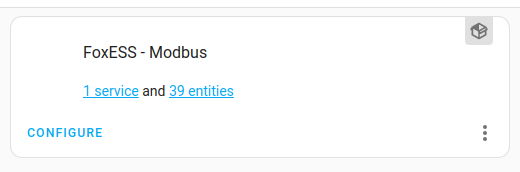
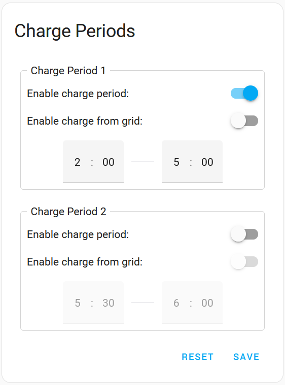
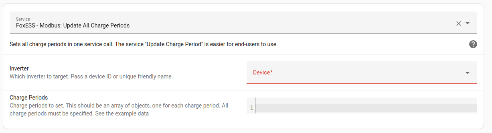

# FoxESS - Modbus (EVO)

[![GitHub Release][releases-shield]][releases]
[![HACS Custom][hacs-shield]][hacs]

\*\* **This project is not endorsed by, directly affiliated with, maintained, authorized, or sponsored by FoxESS** \*\*

## About

This is a fork of [nathanmarlor/foxess_modbus](https://github.com/nathanmarlor/foxess_modbus) — a Home Assistant custom component for communicating with FoxESS inverters locally via Modbus, without relying on FoxESS's cloud.

This fork adds support for the **FoxESS EVO** series of inverters, which are not yet supported upstream.

> **Credit:** Huge thanks to [nathanmarlor](https://github.com/nathanmarlor) and all contributors to the original [foxess_modbus](https://github.com/nathanmarlor/foxess_modbus) project. This fork builds on their excellent work.

## Supported Models

All models from the original project, plus:

- **FoxESS EVO 10-H** (new in this fork)
- FoxESS H1 (including AC1, AIO-H1 and G2)
- FoxESS H3 (including AC3 and AIO-H3)
- FoxESS H3 PRO
- FoxESS KH
- Kuara H3, Sonnenkraft SK-HWR, STAR, Solavita SP, a-TroniX AX, Enpal, 1KOMMA5

## Features

- Direct local communication — no cloud dependency
- Real-time solar production readings (vs. cloud's 5-minute delay)
- Set charge periods, work mode, min/max SoC (model-dependent)
- Multiple connection types: Modbus TCP/UDP/Serial via AUX or LAN port

You will need a direct connection to your inverter. In most cases, this means buying a modbus to ethernet/USB adapter and wiring it to a port on your inverter. See the [upstream wiki](https://github.com/nathanmarlor/foxess_modbus/wiki) for adapter guides and setup instructions.

## Installation

This integration is installed as a **HACS custom repository** (it is not in the default HACS store).

1. Open HACS in Home Assistant
2. Click the three dots menu (top right) > **Custom repositories**
3. Add this URL: `https://github.com/AdamNewberry/foxess_modbus_EVO`
4. Category: **Integration**
5. Click **Add**, then find "FoxESS - Modbus (EVO)" and download it
6. Restart Home Assistant
7. Go to **Settings > Devices & Services > Add Integration**
8. Search for "FoxESS - Modbus (EVO)"
9. Follow the configuration wizard

> **Note:** If you have the original `foxess_modbus` integration installed, this fork uses a different domain (`foxess_modbus_evo`) so they will not conflict. However, running both simultaneously against the same inverter is not recommended.

## Usage

1. Navigate to **Settings > Devices & Services** to find:

1. Select "1 device" to find all Modbus readings:

## Charge Periods

If your inverter supports setting charge periods, you can install the [Charge Periods lovelace card](https://github.com/nathanmarlor/foxess_modbus_charge_period_card).

## Services

### Write Service

A service to write any modbus address is available. Navigate to **Developer Tools > Services** and select it from the drop-down.

### Update Charge Periods

Updates one of the two charge periods (if supported by your inverter).

### Update All Charge Periods

Sets all charge periods in one service call.

## Documentation

For adapter setup guides, wiring instructions, and FAQs, see the [upstream wiki](https://github.com/nathanmarlor/foxess_modbus/wiki). Most of the documentation there applies to this fork as well.

For EVO-specific issues, please [open an issue](https://github.com/AdamNewberry/foxess_modbus_EVO/issues) on this repository.

---

[hacs]: https://hacs.xyz
[hacs-shield]: https://img.shields.io/badge/HACS-Custom-orange.svg?style=for-the-badge
[releases-shield]: https://img.shields.io/github/release/AdamNewberry/foxess_modbus_EVO.svg?style=for-the-badge
[releases]: https://github.com/AdamNewberry/foxess_modbus_EVO/releases
